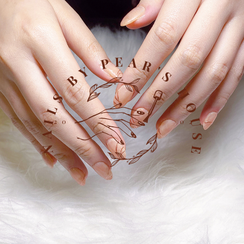
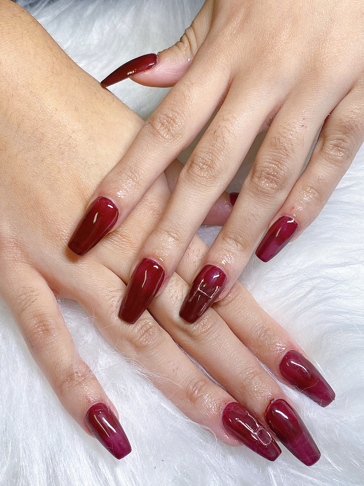
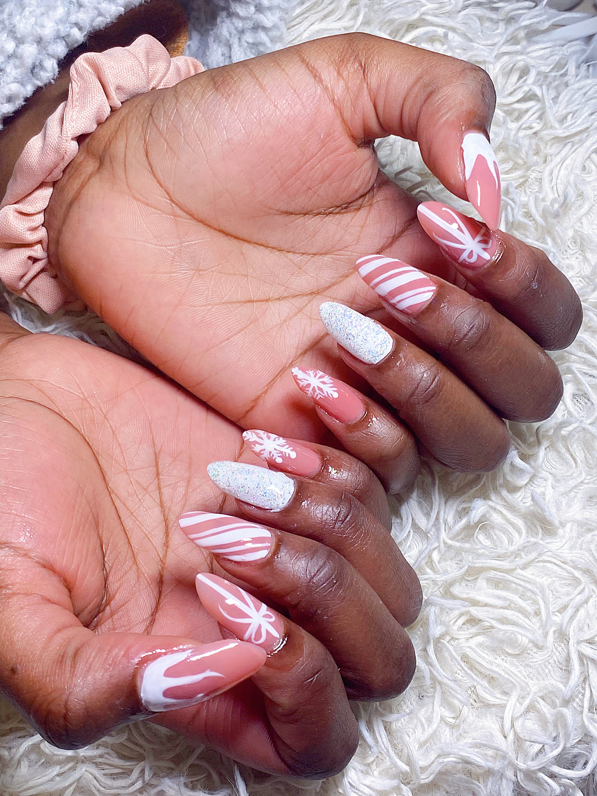

{:width="200"}

##### Nails by Pear's House

 A Korean-Russian Nail Studio

###   Mission and vision

 We focus on growing your nails naturally, healthily, beautifully. We want to bring your nails a healthy, clean look. 
We are a all-gel nail studio. 
We do not use acrylics to perform any services. We use different kinds of gel to bring you the best experience at our studio.
Quality is very important to us because your nail health is important to us.

###   Why do we only do gel?
{:width="500"}
 At our nail studio, we use different kind of gel to perform different services. For instance, we use hard gel to perform extensions or overlay to help protect your nails from breaking. Besides, gel is flexible and glossy but still provide enough protection for your natural nails. Especially, even the thickest gel, hard gel, is still very light on your hand.
For acrylics, you need monomer liquid to perform which causes awful smell. However, gel does not smell like anything. 

###   Our styles
{:width="500"}
 We are a diversity nail room. We adopt different styles
We always keep updating new trends, techniques to ensure we can provide the best services for our clients.
Doing nails is not just for your appearance, it completes your look and it is a therapy session.

### Reviews

Emily stated
>"Nails by Pear’s House is the top place that I would recommend for nail treatment."
Erica stated
>" It is luxury, delicate, sophisticated"
